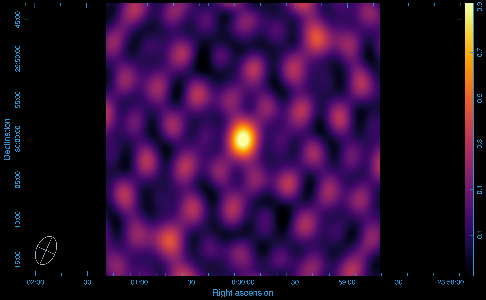

.. _tutorials:

Tutorials
#########

This tutorial demonstrates how to use **visco** for compressing and decompressing radio interferometric data. We generate a Measurement Set (MS) and synthetic visibilities using **simms** and **MeqTrees**, respectively.

Tutorial 1: Compressing and Decompressing KAT-7 Visibility Data
==================================================================

Simulation setup
----------------
- The KAT-7 telescope is simulated for a 1-hour observation, using an integration time of 2 seconds.
- The starting frequency is 1.4 GHz, with 64 channels, each having a width of 100 kHz.
- The visibilities are simulated for a source at the phase centre that is unpolarized, with a total intensity of 1 Jy.
- The visibilities are simulated with noise.
- The full rank of the data is :math:`\min(\mathrm{timeslots}, \mathrm{channels}) = 64`.

Data image
----------
The data image is produced using WSClean. 

.. note::
   Dirty images are used here because compression can affect the Point Spread Function (PSF).

Statistics
-----------

We use CARTA to open the images and measure the statistics:

- **Peak flux:** \(:math:`1.000429391861 \times 10^{0}`\) Jy/beam
- **RMS:** \(:math:`1.439807312603 \times 10^{-1}`\) Jy/beam
- **SNR:** 6.9484

Disk usage
-----------

The MS occupies 228 MB of disk storage.

Compressing the Visibility Data
----------------------------------
Now, we use **visco** compression functionality to compress the visibility data using singular value decomposition (SVD). SVD decomposes the visibility data for each baseline and correlation into three matrix components, U,S, and W. These three components are stored in a **Zarr** store. To compress the visibility data, run:

::

   visco compressms -ms kat7-sim.ms/ -zs kat7-sim.zarr -col DATA -corr XX,XY,YX,YY -cr 1 -nw 8 -nt 1 -ml 4GB -da 2727 -csr 3600

where:

- `-ms` gives the path to the measurement set to compress,
- `-zs` specifies the output Zarr store path,
- `-col` specifies the column containing the visibility data,
- `-corr` defines the correlations to compress,
- `-cr` is the desired compression rank,
- `-nw` sets the number of Dask workers,
- `-nt` specifies the number of threads per worker,
- `-ml` sets the memory limit,
- `-da` is the dashboard address,
- `-csr` is the chunk size along the row.

The flag -cr 1 signifies that the data is compressed using only the first singular value. This means that only the compnents of U and W corresponding to the first (highest) value of S are kept in the **Zarr** store. To see how the compression impacts the data, we have to decompress the data from the **Zarr** store back into an MS. To do this, we use the decompression functionality of **visco**.

Decompressing the data from Zarr to MS
---------------------------------------

To decompress the data from a **zarr** store back into an MS for imaging, run:

::

   visco decompressms -zp kat7-sim.zarr/ -ms kat7-sim-decompressed.ms

where:

- `-zp` provides the path to the Zarr store containing the compressed data,
- `-ms` sets the output MS file.

Imaging the compressed Data
-----------------------------

After decompressing the data, we turn to WSClean again to image the data. The output image we get is:

Statistics
----------

- **Peak flux:** \(:math:`1.000427842140 \times 10^{0}`\) Jy/beam
- **RMS:** \(:math:`1.439824590852 \times 10^{-1}`\) Jy/beam
- **SNR:** 6.9483

Smearing
--------
To see the imapct of compression, the most useful test to perform is to measure the level of smearing incurred  by the compression. After compression, more than 99.99% of the peak flux from the original image is recovered, therefore, there is no smearing incurred by the compression. 

Disk usage 
-----------
The Zarr store containing the compressed visibility data, along with the rest of the MS data, occupies only 15 MB, representing a compression factor of 15.

Tutorial 2: Improving Compression Speed using Correlations 
===========================================================

Compressing the visibility data using SVD is computationally expensive. Futhermore, the process is performed for each baseline and correlation product. To reduce the computational cost, one can choose to combine correlations. This approach speeds up the compression by grouping the XX & YY and XY & YX correlations together.

Although our simulation so far includes an unpolarized source where the XY and YX correlations contribute minimally, we can still test this approach. To do so, we simply add the ``--correlation-optimized`` flag to our run:

::

   visco compressms -ms kat7-sim.ms/ -zs kat7-sim.zarr -col DATA -corr XX,XY,YX,YY -cr 1 -nw 8 -nt 1 -ml 4GB -da 2727 -csr 3600 --correlation-optimized

Data image
----------

We have included the --correlation-optimized flag, which let us speed up the compression process, in the run. To see the impact of the compression, we, as previous, decompress the data from the **zarr** store back to an MS. The image produced from this process is:

Statistics
------------

- **Peak flux:** \(:math:`1.000429391861 \times 10^{0}`\) Jy/beam
- **RMS:** \(:math:`1.439828319666 \times 10^{-1}`\) Jy/beam
- **SNR:** 6.9483

Smearing
----------
We note here, too, that there is no smearing effects incurred by the compression.

Disk usage
------------
This method further reduces the disk storage occupied by the **zarr** store, with only 9 MB occupied. The compression factor achieved is 25.

Tutorial 3: Compressing and Decompressing MeerKAT Visibility Data
==================================================================

Now, lets focus on the MeerKAT telescope, the reason for the development of this package.

Simulation setup
------------------

- We use the same simulation settings we used for the KAT-7.
- Our sky model now includes 10 unpolarized point sources, each with a total intensiy of 1 Jy

Data image
-----------

For this simulation, we get this image:

.. image:: meerkat-sim-dirty.png
   :alt: Original image for the MeerKAT simulation
   :width: 400px
   :align: center

Statistics
-------------

In this case, we will use the source furthest from the phase centre.

- **Peak flux:** \(:math:`9.897630810738e \times 10^{-1}`\) Jy/beam
- **RMS:** \(:math:`1.672033648492 \times 10^{-2}`\) Jy/beam
- **SNR:** 59.1954

Disk usage
----------
The MS occupies 43 GB of disk storage.

Compression using first singular value
---------------------------------------

The compression for the MeerKAT telescope is extremely computationally expensive as there are 2016 baselines, so we add the --batch-size flag, which let us decide the number of the baselines to process at the same time. We still choose to compress using the first singular value.

::

   visco compressms -ms meerkat-sim.ms/ -zs meerkat-sim.zarr -col DATA -corr XX,XY,YX,YY -cr 1 -nw 8 -nt 1 -ml 4GB -da 2727 -csr 10000 -bs 200

where:

- `-bs` determine the batch size or the number of baselines to process at once.

Data image
----------
After compressing the data using only the first singular value, we get this image:

.. image:: meerkat-sim-cr1-dirty.png
   :alt: First singular image for the MeerKAT simulation
   :width: 400px
   :align: center

Statistics
------------
Looking at the image produced after the compression, there is no immediate difference. However, going back to the furthest source from the phase centre, we get:

- **Peak flux:** \(:math:`5.085088610649 \times 10^{-1}`\) Jy/beam
- **RMS:** \(:math:`1.192684202182 \times 10^{-2}`\) Jy/beam
- **SNR:** 42.6357

Smearing
---------

After compression with the first singular value, only 51% of the peak flux is recovered on the source furthest from the phase centre. This demonstrates that in  this case, the first singular value is not sufficient to fully retain or recover the signal. Consequently, we must to use more singular values in the compression.

Disk usage
----------
The **zarr** store containing the compressed data only occupies  1.2 GB of disk storage, representing a compression factor of 35.

Compression using the first 6 singular values
------------------------------------------------
Since compression using only the first singular value did not work, here we try to use the first 6 singular values. We only change our --cr flag on our run:

::

   visco compressms -ms meerkat-sim.ms/ -zs meerkat-sim.zarr -col DATA -corr XX,XY,YX,YY -cr 6 -nw 8 -nt 1 -ml 4GB -da 2727 -csr 10000 -bs 200

Data image
----------
After compressing the data using the first 6 singular value, we get this image:

.. image:: meerkat-sim-cr6-dirty.png
   :alt: First singular image for the MeerKAT simulation
   :width: 400px
   :align: center

Statistics
------------
With the first 6 singular values, we get:

- **Peak flux:** \(:math:`9.898513555527 \times 10^{-1}`\) Jy/beam
- **RMS:** \(:math:`1.672275516698 \times 10^{-2}`\) Jy/beam
- **SNR:** 59.1919

Smearing
---------

After compression with the first 6 singular value, 100% of the peak flux was recovered for the source furthest from the phase centre. This means that the first 6 singular values are sufficient for the compression and to fully retain the signal.

Disk usage
----------
The **zarr** store containing the compressed data now occupies  2.2 GB of disk storage, representing a compression factor of 20.

Compression using the Decorrelation flag
----------------------------------------

