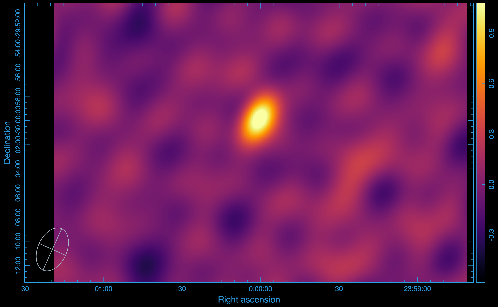
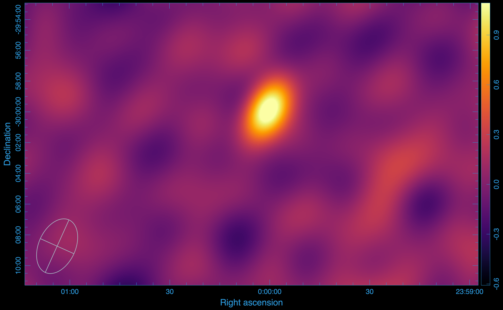

.. _tutorials:

Tutorials
#########

This tutorial demonstrates how to use **visco** for compressing and decompressing radio interferometric data. We generate a Measurement Set (MS) and synthetic visibilities using `simms` and MeqTrees, respectively.

Point Source Simulation at Phase Centre with KAT-7
==================================================

- The telescope is simulated with a 1-hour observation, using an integration time of 2 seconds.
- The starting frequency is 1.4 GHz, with 64 channels, each with a width of 100 kHz.
- The source is unpolarized with a total intensity of 1 Jy.

Original image produced using WSClean:

Using CARTA, we measure the peak flux of the image to be \(1.233 \times 10^{0}\) Jy/beam and the RMS to be \(1.285 \times 10^{-1}\) Jy/beam.

Compressing the Visibility Data
------------------------------

To compress the visibility data, run:

::

   visco compressms -ms kat7-sim.ms/ -zs kat7-sim.zarr -corr XX,XY,YX,YY -cr 1 -nw 8 -nt 1 -ml 16GB -da 2727 -csr 3600

where:

- `-ms` gives the path to the measurement set,
- `-zs` specifies the output Zarr store,
- `-corr` defines the correlations to compress,
- `-cr` is the desired compression rank,
- `-nw` sets the number of Dask workers,
- `-nt` specifies the number of threads per worker,
- `-ml` sets the memory limit,
- `-da` is the dashboard address,
- `-csr` is the chunk size along the row.

We compressed the data with a compression rank of 1, retaining only the components corresponding to the first singular value.

After compression, the data is stored as `meerkat-sim.zarr`.

Decompressing the Compressed Data
---------------------------------

To decompress back into an MS for imaging, run:

::

   visco decompressms -zp kat7-sim.zarr/ -ms kat7-sim-decompressed.ms

where:

- `-zp` provides the path to the Zarr store containing the compressed data,
- `-ms` sets the output MS file.

After decompression, the output image (produced using WSClean) is:

The image produced from the compressed visibility data has a peak flux of \(1.249 \times 10^{0}\) Jy/beam and an RMS of \(1.314 \times 10^{-1}\) Jy/beam.

**SNR:**
The SNR for the original image is 9.595 and for the image after compression, its 9.505.

**Disk usage:**  
The original MS occupies 228 MB, while the compressed Zarr store uses only 15 MB of disk space.

