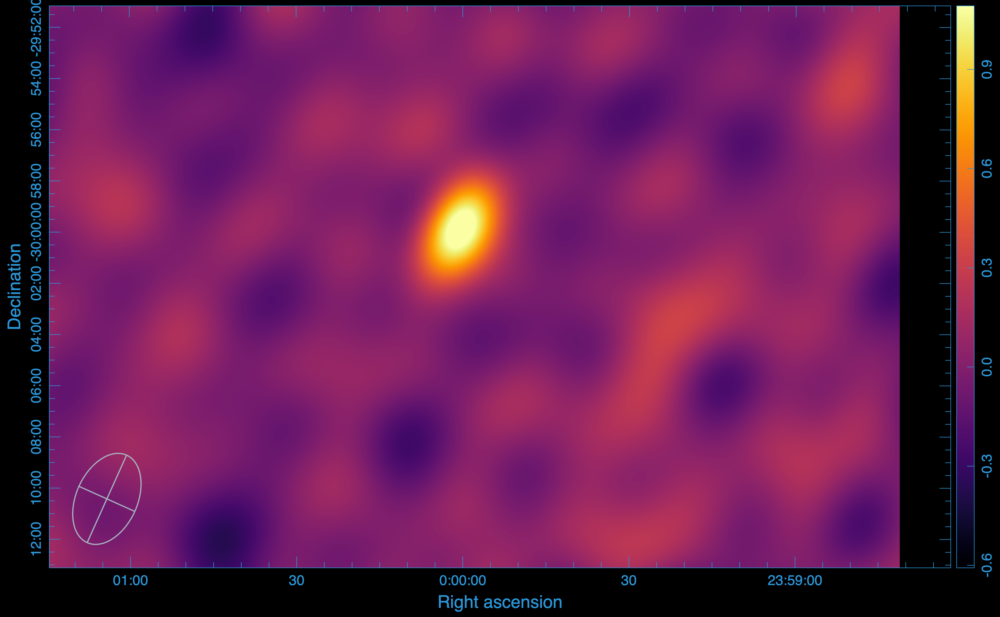

=========
Tutorials
=========

Optimized Compression with Correlation Combining
-------------------------------------------------

Overview
~~~~~~~~

For unpolarized sources, the cross-correlation products (XY and YX) contribute minimal signal. Combining correlations during compression can significantly improve computational speed and further reduce storage requirements.

Optimized Compression Command
~~~~~~~~~~~~~~~~~~~~~~~~~~~~~

To enable correlation optimization, add the ``--correlation-optimized`` flag:

::

   visco compressms -ms kat7-sim.ms/ -zs kat7-sim.zarr -corr XX,XY,YX,YY -cr 1 -nw 8 -nt 1 -ml 16GB -da 2727 -csr 3600 --correlation-optimized

Benefits
~~~~~~~~

1. **Computational efficiency:** Reduces processing time by compressing combined correlation products
2. **Storage savings:** Further reduces disk usage compared to standard compression
3. **Maintained fidelity:** Preserves image quality for unpolarized sources

Imaging Results
~~~~~~~~~~~~~~~

The image produced with correlation optimization:

Storage Comparison
~~~~~~~~~~~~~~~~~~

- **Original measurement set:** 228 MB
- **Standard compressed Zarr:** 15 MB
- **Optimized compressed Zarr:** 9 MB

The correlation-optimized approach provides a compression ratio of approximately **25:1**, offering substantial storage savings for unpolarized data.

Summary
-------

The **visco** package provides efficient compression of radio interferometry visibility data:

1. **Standard compression** (rank 1): Reduces 228 MB to 15 MB (~15:1 ratio)
2. **Optimized compression** (correlation combining): Reduces 228 MB to 9 MB (~25:1 ratio)
3. **Image quality:** Minimal degradation (SNR: 9.595 → 9.505)
4. **Use case:** Ideal for archiving, data transfer, and processing large interferometric datasets

These compression techniques enable more efficient storage and handling of large-scale radio astronomy data while maintaining scientific integrity.
